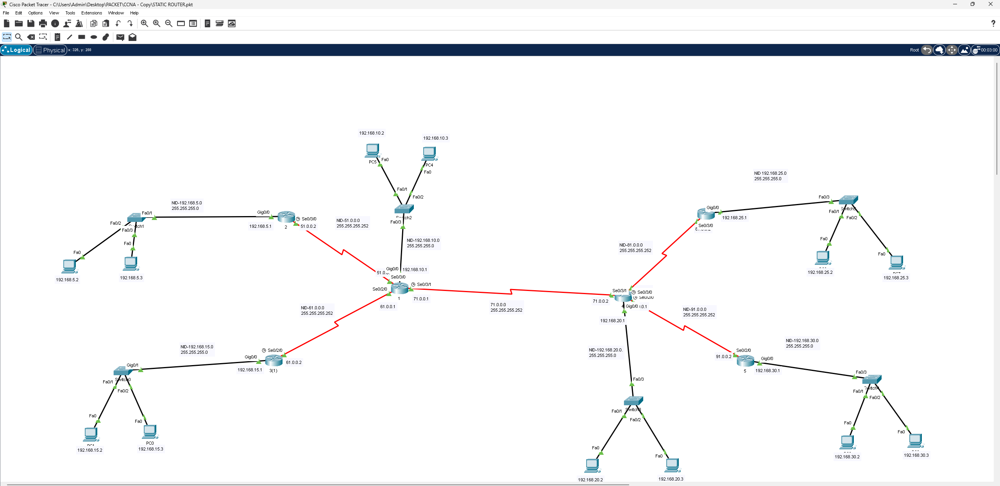

# Static Router (Basic) – توجيه ساكن على 6 مواقع مترابطة

## 📖 الوصف
مشروع توجيه ساكن (Static Routing) أساسي يربط 6 راوترات في تصميم شبه شبكي (Partial Mesh)، بعناوين IP من نطاقات مختلفة (Class B و Class C).

## 🗺️ التصميم (Topology)

6 راوترات مرتبطة عبر روابط Serial متعددة، وكل راوتر يخدم شبكة LAN خاصة:

| الشبكة | القناع |
|--------|--------|
| `192.168.5.0/24` | Class C |
| `192.168.10.0/24` | Class C |
| `192.168.15.0/24` | Class C |
| `192.168.20.0/24` | Class C |
| `192.168.25.0/24` | Class C |
| `192.168.30.0/24` | Class C |

### روابط WAN بين الراوترات
`51.0.0.0/30`, `61.0.0.0/30`, `71.0.0.0/30`, `81.0.0.0/30`, `91.0.0.0/30`

## ⚙️ المفاهيم المطبقة
- تصميم شبكة موزعة بروابط Serial متعددة بين الراوترات
- كتابة جداول توجيه ساكن كاملة (Static Routing Tables) لضمان اتصال كل الشبكات ببعضها
- التعامل مع عناوين شبكات من فئة C كاملة (بدون تقسيم فرعي معقد)

## 🎯 الهدف من المشروع
تطبيق أساسيات التوجيه الساكن بشكل عملي ومباشر، وهو المشروع التأسيسي الذي يبني عليه المتدرب فهمًا أعمق لمفاهيم Static Routing قبل الانتقال لتقنيات أكثر تعقيدًا مثل VLSM أو Route Summarization.

## 📂 الملف
- [`Static-Router.pkt`](./Static-Router.pkt) — ملف Packet Tracer الكامل
